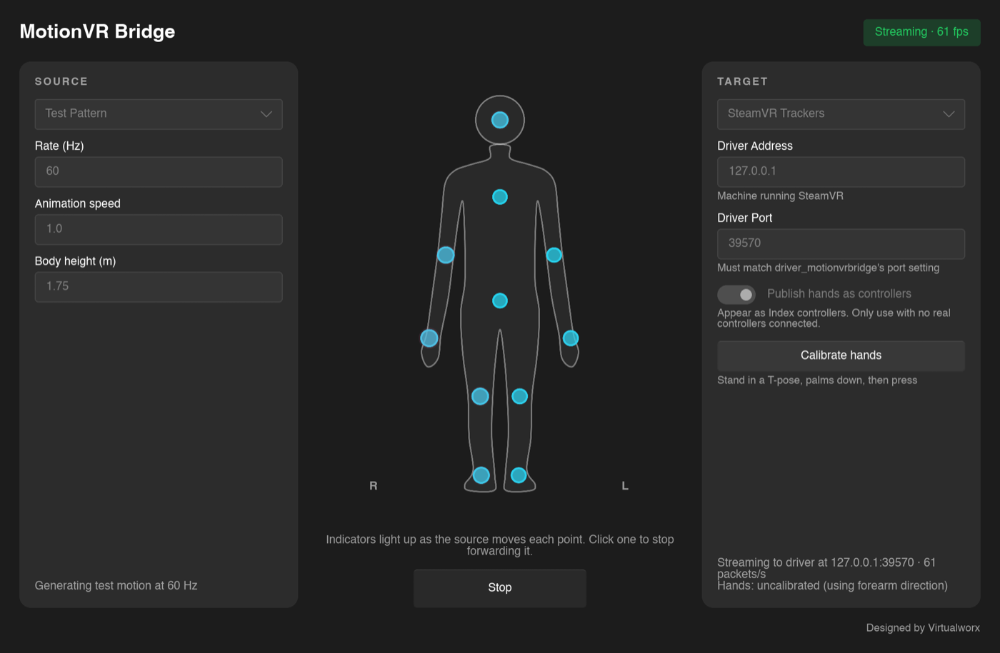

# MotionVR Bridge

MotionVR Bridge streams full-body motion capture into VR. Pick a source (Captury Live, Vicon, Xsens MVN or Open3DStream)
and a target (VRChat's OSC trackers, or SteamVR, where your body shows up as virtual trackers
and optionally your hands as controllers), then press Start.

## Download

| Platform | Download |
|---|---|
| Windows (installer, includes the SteamVR driver) | [MotionVRBridge-Windows-Setup.exe](https://github.com/medcelerate/MotionVR-Bridge/releases/latest/download/MotionVRBridge-Windows-Setup.exe) |
| Windows (portable) | [MotionVRBridge-Windows-Portable.zip](https://github.com/medcelerate/MotionVR-Bridge/releases/latest/download/MotionVRBridge-Windows-Portable.zip) |
| SteamVR driver only (Windows) | [MotionVRBridge-SteamVR-Driver-Setup.exe](https://github.com/medcelerate/MotionVR-Bridge/releases/latest/download/MotionVRBridge-SteamVR-Driver-Setup.exe) |
| macOS (Apple Silicon) | [MotionVRBridge-macOS.zip](https://github.com/medcelerate/MotionVR-Bridge/releases/latest/download/MotionVRBridge-macOS.zip) |
| Linux (x64, Ubuntu 24.04+) | [MotionVRBridge-Linux-x64.tar.gz](https://github.com/medcelerate/MotionVR-Bridge/releases/latest/download/MotionVRBridge-Linux-x64.tar.gz) |

See the [guide](docs/GUIDE.md) for setup and building from source.

Designed by [Virtualworx](https://virtualworx.io). Licensed under the [GPL-3.0](LICENSE) with an
[exception](LICENSE-EXCEPTION) for the Vicon DataStream SDK.
